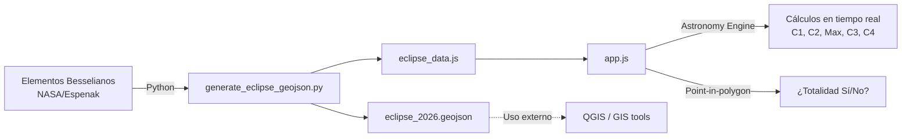

# ☀️🌑 Eclipse Solar España 2026

**Mapa interactivo de alta precisión** para el eclipse solar total del **12 de agosto de 2026** visible desde España.

Permite a cualquier usuario buscar su localidad (o hacer clic en el mapa) y obtener los **horarios exactos** de cada fase del eclipse, el porcentaje de oscurecimiento y si se encuentra dentro de la franja de totalidad.

---

## 🖥️ Demo

**Prueba la aplicación interactiva aquí:** [https://marcopro.github.io/spaineclipse2026/](https://marcopro.github.io/spaineclipse2026/)


La aplicación muestra:

- 🗺️ **Mapa interactivo** con la franja de totalidad superpuesta (polígono GeoJSON)
- ☁️ **Mapa de nubes histórico** (Heatmap) basado en probabilidad estadística (2015-2025)
- 🌑 **Simulación de la sombra (Umbra)** animada en tiempo real
- 🔍 **Buscador de localidades** con autocompletado vía Nominatim (OpenStreetMap)
- 📍 **Geolocalización** para detectar tu posición automáticamente
- 📊 **Panel informativo** con tiempos de contacto (C1–C4), duración y oscurecimiento
- 🌅 **Alerta de puesta de sol** si el eclipse coincide con el ocaso
- 📱 **Diseño adaptado** para una visualización perfecta en dispositivos móviles

---

## 🏗️ Arquitectura

```
eclipse/
├── index.html                  # Punto de entrada de la aplicación
├── styles.css                  # Estilos con glassmorphism y diseño dark mode
├── app.js                      # Lógica principal del frontend (mapa, búsqueda, cálculos)
├── cloud_heatmap.js            # Capa del mapa de probabilidad histórica de nubes
├── eclipse_data.js             # Datos GeoJSON de la franja de totalidad (generado)
├── eclipse_2026.geojson        # Datos GeoJSON puros (para uso externo/GIS)
├── scripts/
│   ├── generate_eclipse_geojson.py  # Generador de la franja desde Elementos Besselianos
│   └── generate_cloud_heatmap.py    # Recopilador de datos de meteorología para el heatmap
└── README.md
```

### Flujo de datos



---

## 🔬 Metodología científica

### Generación de la franja de totalidad

El script Python (`scripts/generate_eclipse_geojson.py`) calcula la geometría de la franja directamente desde los **Elementos Besselianos oficiales de NASA/Espenak**:

| Parámetro | Descripción |
|-----------|-------------|
| `X_COEFFS`, `Y_COEFFS` | Coordenadas del centro de la sombra en el plano fundamental |
| `D_COEFFS` | Declinación del eje de la sombra |
| `L2_COEFFS` | Radio del cono de sombra (penumbra exterior) |
| `MU_COEFFS` | Ángulo horario del eje |
| `DELTA_T` | Diferencia entre el Tiempo Terrestre (TT/TDT) y el Tiempo Universal (UT), fijado en **69.11 segundos** para ajustar la rotación de la Tierra. |

**Método de cálculo:**

1. **Línea central:** proyección directa `(x, y) → (lat, lon)` sobre elipsoide WGS84.
2. **Límites norte/sur:** para cada meridiano objetivo, se barren **todos los instantes** del eclipse. En cada instante se calcula dónde el borde del círculo umbral interseca ese meridiano. La latitud máxima encontrada es el límite norte real; la mínima es el límite sur.
3. **Corrección de limbo lunar (`L2_CORRECTION`):** los Elementos Besselianos asumen una Luna esférica. Se aplica una corrección de +0.0005 al radio umbral calibrada contra 4 puntos de referencia oficiales (Bilbao, Galicia, Madrid, Cullera) para compensar el perfil real del limbo lunar (Watts' charts).
4. **Post-procesado:** recorte de extremos con ancho < 0.5° y suavizado con media móvil de 5 puntos.

**Precisión:** < 0.2 km vs tabla oficial NASA para la línea central.

### Simulación de la Sombra y Meteorología

- **Animación de la Umbra:** La aplicación incluye una simulación visual de la sombra umbral animada sobre el mapa. El tamaño y posición de la sombra se calculan de manera precisa desvinculando la renderización visual del cálculo exacto de la duración para asegurar sincronía con las horas reales de contacto locales.
- **Mapa Histórico de Nubes (Heatmap):** El script `scripts/generate_cloud_heatmap.py` obtiene y promedia datos históricos de cobertura nubosa para el 12 de agosto a lo largo de 5 años (2020-2024), empleando técnicas de limitación de tasa (rate-limit) y backoff exponencial para interactuar con la API meteorológica. Este mapa sirve como guía de probabilidad para buscar zonas despejadas.

### Cálculos en el frontend

El frontend utiliza **[Astronomy Engine](https://github.com/cosinekitty/astronomy)** para calcular en tiempo real:

- **Fases de contacto** (C1–C4) para cualquier coordenada
- **Oscurecimiento máximo** del disco solar
- **Puesta de sol** local para avisar si coincide con el eclipse

La **determinación de totalidad** usa un test **point-in-polygon** (ray casting) contra el polígono GeoJSON como fuente de verdad, ya que Astronomy Engine y los Elementos Besselianos usan modelos de sombra ligeramente diferentes.

---

## 🛠️ Stack tecnológico

| Tecnología | Uso |
|------------|-----|
| **HTML5 / CSS3 / JavaScript** | Frontend puro, sin frameworks |
| **[Leaflet](https://leafletjs.com/)** v1.9.4 | Mapa interactivo |
| **[Astronomy Engine](https://github.com/cosinekitty/astronomy)** v2.1.19 | Cálculos astronómicos en tiempo real |
| **[Nominatim](https://nominatim.openstreetmap.org/)** | Geocodificación directa e inversa |
| **[OpenStreetMap](https://www.openstreetmap.org/)** | Tiles del mapa base |
| **Python 3** | Generación offline de datos GeoJSON |
| **[Font Awesome](https://fontawesome.com/)** v6.4 | Iconografía |
| **[Google Fonts](https://fonts.google.com/)** (Outfit) | Tipografía |

---

## 🚀 Uso

### Visualizar la aplicación

Simplemente abre `index.html` en un navegador moderno. No requiere servidor ni compilación.

```bash
# Opción 1: abrir directamente
open index.html

# Opción 2: servidor local (recomendado para evitar restricciones CORS)
python3 -m http.server 8080
# Navega a http://localhost:8080
```

### Regenerar los datos GeoJSON

Si necesitas recalcular la franja de totalidad (por ejemplo, tras ajustar la corrección de limbo lunar):

```bash
python3 scripts/generate_eclipse_geojson.py
```

Esto genera:
- `eclipse_2026.geojson` — GeoJSON estándar
- `eclipse_data.js` — Variable JS exportada para carga directa en el frontend

### Regenerar los datos de Meteorología (Nubes)

Si deseas actualizar o recalcular el historial de cobertura nubosa (por ejemplo, ampliando el rango de años):

```bash
python3 scripts/generate_cloud_heatmap.py
```

> **Aviso:** Este script realiza múltiples llamadas a la API histórica de Open-Meteo. Implementa pausas automáticas (rate-limit y backoff exponencial) para no exceder los límites gratuitos, por lo que su ejecución puede tardar unos minutos.

Esto genera:
- `cloud_heatmap.js` — Variable JS con los datos de probabilidad de nubes exportada para el frontend.

---

## 🎨 Diseño

La interfaz utiliza un enfoque **dark mode** con estética de **glassmorphism**:

- Paneles con `backdrop-filter: blur(16px)` y bordes translúcidos
- Paleta oscura (`#0a0b10`) con acentos dorados (`#ffcc00`) que evocan la corona solar
- Tipografía moderna [Outfit](https://fonts.google.com/specimen/Outfit) con pesos variados
- Animaciones suaves (`cubic-bezier`) en transiciones y apariciones
- Diseño responsive con breakpoint a 600px

---

## 📚 Referencias

- [Elementos Besselianos del eclipse — NASA/Espenak](https://eclipse.gsfc.nasa.gov/SEbeselm/SEbeselm2001/SE2026Aug12Tbeselm.html)
- [Astronomy Engine — Don Cross](https://github.com/cosinekitty/astronomy)
- [Xavier Jubier — Interactive Eclipse Maps](http://xjubier.free.fr/en/site_pages/solar_eclipses/TSE_2026_GoogleMapFull.html)
- [TimeAndDate — Eclipse 2026](https://www.timeanddate.com/eclipse/solar/2026-august-12)

---

## 📄 Licencia

Este proyecto es de uso personal y educativo.

---

> **Nota:** Todos los horarios se muestran en hora local española (Europe/Madrid, CEST — UTC+2 en agosto).
