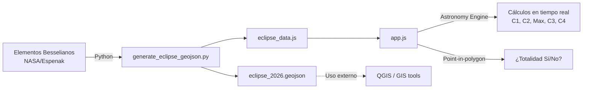

# ☀️🌑 Eclipse Solar España 2026

**Mapa interactivo de alta precisión** para el eclipse solar total del **12 de agosto de 2026** visible desde España.

Permite a cualquier usuario buscar su localidad (o hacer clic en el mapa) y obtener los **horarios exactos** de cada fase del eclipse, el porcentaje de oscurecimiento y si se encuentra dentro de la franja de totalidad.

---

## 🖥️ Demo

**Prueba la aplicación interactiva aquí:** [https://marcopro.github.io/spaineclipse2026/](https://marcopro.github.io/spaineclipse2026/)


La aplicación muestra:

- 🗺️ **Múltiples Mapas Base** interactivos (Estándar, Satélite y Relieve Topográfico)
- ⛰️ **Análisis de Altitud 3D**, calculando el impacto de tu elevación (0-3000m) en los tiempos del eclipse
- 📡 **Radar de Horizonte en Vivo**, generando gráficas de perfiles montañosos cruzados con la trayectoria del sol
- ☁️ **Mapa de nubes histórico** (Heatmap) basado en probabilidad estadística (2010-2024)
- 🌑 **Simulación de la sombra (Umbra)** animada en tiempo real
- 🔍 **Buscador de localidades** con autocompletado vía Nominatim (OpenStreetMap)
- 📍 **Geolocalización** para detectar tu posición automáticamente
- 📊 **Panel informativo** con tiempos de contacto (C1–C4) ajustados a la curvatura terrestre
- 🌅 **Alertas de visibilidad**: puesta de sol y montañas bloqueando la totalidad
- 📱 **Diseño adaptado** para una visualización perfecta en dispositivos móviles

---

## 🏗️ Estructura del Proyecto

### Archivos del Frontend (Web App)
- `index.html`: Punto de entrada principal. Contiene la estructura DOM, el modal de información y el contenedor del mapa.
- `app.js`: Motor principal de la aplicación. Maneja el mapa Leaflet, la geolocalización, la búsqueda, la animación de la sombra, el gráfico de horizonte y la interfaz.
- `besselian_calculator.js`: Motor matemático puro. Utiliza los elementos besselianos para calcular el instante exacto, duración y oscurecimiento con precisión de sub-segundos corrigiendo la altitud terrestre.
- `config.js`: Archivo de configuración centralizado (única fuente de la verdad). Almacena los elementos besselianos, deltas de tiempo, y parámetros de conexión para APIs y capas topográficas.
- `styles.css`: Hoja de estilos principal con diseño *glassmorphism*, dark mode y diseño responsive para móviles.
- `pois.js`: Base de datos local con Puntos de Interés (miradores, ciudades clave) para autocompletado y marcadores sugeridos en el mapa.
- `sw.js`: *Service Worker*. Cachea todos los archivos de la app para que funcione 100% offline (sin internet) el día del eclipse.
- `manifest.json`: Archivo de manifiesto que permite instalar la web como una app nativa en el móvil (PWA).

### Archivos de Datos (Generados)
- `eclipse_data.js`: Contiene el polígono WGS84 de la franja de totalidad, ajustado por los algoritmos asimétricos del limbo lunar.
- `cloud_heatmap.js`: Matriz estadística con la probabilidad de nubes en cada coordenada de la franja de totalidad.
- `topography_data.js`: Cuadrícula con las altitudes locales (modelo SRTM) utilizada para los cálculos matemáticos de fase y precisión.
- `eclipse_2026.geojson`: El archivo crudo GeoJSON de la franja, ideal para exportar a QGIS o herramientas GIS de terceros.

### Scripts de Backend (Python)
- `scripts/generate_eclipse_geojson.py`: Motor de geometría espacial. Lee los elementos besselianos, genera la franja en WGS84 aplicando un modelo polinómico avanzado para los límites norte y sur, y crea el GeoJSON.
- `scripts/generate_topography_gee.py`: Se conecta a Google Earth Engine, escanea la franja del eclipse sobre el modelo SRTM de la Tierra y exporta la cuadrícula de altitudes.
- `scripts/generate_cloud_heatmap_gee.py`: Extrae y promedia 15 años de datos climáticos del modelo ERA5 (Copernicus) a través de Google Earth Engine para construir el mapa de probabilidad de nubes.

### Flujo de datos



---

## 🔬 Metodología científica

### Generación de la franja de totalidad

El script Python (`scripts/generate_eclipse_geojson.py`) calcula la geometría de la franja directamente desde los **Elementos Besselianos oficiales de NASA/Espenak**:

| Parámetro | Descripción |
|-----------|-------------|
| `X_COEFFS`, `Y_COEFFS` | Coordenadas del centro de la sombra en el plano fundamental |
| `D_COEFFS` | Declinación del eje de la sombra |
| `L2_COEFFS` | Radio del cono de sombra (penumbra exterior) |
| `MU_COEFFS` | Ángulo horario del eje |
| `DELTA_T` | Diferencia entre el Tiempo Terrestre (TT/TDT) y el Tiempo Universal (UT), fijado en **69.11 segundos** para ajustar la rotación de la Tierra. |

**Método de cálculo:**

1. **Línea central:** proyección directa `(x, y) → (lat, lon)` sobre elipsoide WGS84.
2. **Límites norte/sur:** para cada meridiano objetivo, se barren **todos los instantes** del eclipse. En cada instante se calcula dónde el borde del círculo umbral interseca ese meridiano. La latitud máxima encontrada es el límite norte real; la mínima es el límite sur.
3. **Corrección de limbo lunar (Efecto Embudo Asimétrico):** Los Elementos Besselianos clásicos asumen una Luna esférica perfecta, pero en la realidad, las montañas y valles del contorno lunar (Watts' profile) deforman la sombra proyectada. Para lograr replicar con máxima fidelidad los mapas astronómicos profesionales (como los de Xavier Jubier), hemos sustituido la clásica corrección fija de radio umbral (`L2`) por un motor de corrección matemático dinámico e independiente para los límites NORTE y SUR.
   Cada límite se deforma mediante un polinomio de segundo grado gobernado por 3 variables:
   - **`BASE`:** Determina el colchón de ensanchamiento o estrechamiento general.
   - **`SLOPE` (Pendiente):** Genera el efecto de "embudo" lineal a lo largo de la trayectoria. Como el tiempo `t` a lo largo de España discurre desde `~0.42` en Galicia hasta `~0.55` en el Mediterráneo, una pendiente negativa provoca que el ensanchamiento sea agresivo en la entrada noroeste y se vaya estrechando progresivamente hacia la salida este.
   - **`QUAD` (Curvatura Cuadrática):** Introduce una aceleración exponencial al embudo (`t²`), permitiendo crear límites cóncavos o convexos (por ejemplo, que la franja se estreche de golpe justo antes de salir al mar) para calcar con exactitud la topografía irregular del limbo lunar.
4. **Post-procesado:** recorte de extremos con ancho < 0.5° y suavizado con media móvil de 5 puntos.

**Precisión:** < 0.2 km vs tabla oficial NASA para la línea central.

### Topografía y Detección de Horizonte (Sistema Híbrido)

- **Precisión Altimétrica Offline (`topography_data.js`)**: El script `scripts/generate_topography_gee.py` extrae un mapa offline con la altitud sobre el nivel del mar a partir del modelo digital de elevaciones (SRTM). Al hacer clic en un valle o una montaña alta (ej. 2.500m), la aplicación introduce matemáticamente esa ganancia de altitud en las ecuaciones geométricas de Bessel para arrojar el segundo exacto en el que el cono de sombra de la Luna barrerá físicamente tu ubicación (en las alturas los contactos suceden fracciones de segundo antes).
- **Radar de Horizonte en Tiempo Real (Open-Meteo)**: Un sofisticado motor de *ray-casting* direccional. Al hacer clic, se calcula la posición del sol en el cielo (Azimut y Elevación). Acto seguido, dispara 20 trazadores a lo largo de 20 km sobre la superficie terrestre en la dirección óptica del Sol. Obtiene el perfil del terreno usando la API en vivo de Open-Meteo Elevation, corrige la curvatura de la Tierra de las montañas, y grafica un perfil del terreno contra la línea de visión del Sol informando de forma visual (y mediante alertas) si la montaña cortará el eclipse o no.

### Meteorología Estadística

- **Mapa Histórico de Nubes (Heatmap):** El script `scripts/generate_cloud_heatmap_gee.py` obtiene y promedia datos históricos de cobertura nubosa exacta para el 12 de agosto a las 18:00 UTC a lo largo de 15 años (2010-2024). Utiliza el motor de Google Earth Engine para extraer información del modelo climático global ERA5 del ECMWF.

### Cálculos en el frontend

El frontend utiliza **[Astronomy Engine](https://github.com/cosinekitty/astronomy)** para calcular en tiempo real:

- **Fases de contacto** (C1–C4) para cualquier coordenada
- **Oscurecimiento máximo** del disco solar
- **Puesta de sol** local para avisar si coincide con el eclipse

La **determinación de totalidad** usa un test **point-in-polygon** (ray casting) contra el polígono GeoJSON como fuente de verdad, ya que Astronomy Engine y los Elementos Besselianos usan modelos de sombra ligeramente diferentes.

---

## 🛠️ Stack tecnológico

| Tecnología | Uso |
|------------|-----|
| **HTML5 / CSS3 / JavaScript** | Frontend puro, sin frameworks |
| **[Leaflet](https://leafletjs.com/)** v1.9.4 | Mapa interactivo |
| **[Astronomy Engine](https://github.com/cosinekitty/astronomy)** v2.1.19 | Cálculos astronómicos en tiempo real |
| **[Nominatim](https://nominatim.openstreetmap.org/)** | Geocodificación directa e inversa |
| **[OpenStreetMap](https://www.openstreetmap.org/)** | Tiles del mapa base |
| **Python 3** | Generación offline de datos GeoJSON |
| **[Font Awesome](https://fontawesome.com/)** v6.4 | Iconografía |
| **[Google Fonts](https://fonts.google.com/)** (Outfit) | Tipografía |

---

## 🚀 Uso

### Visualizar la aplicación

Simplemente abre `index.html` en un navegador moderno. No requiere servidor ni compilación.

```bash
# Opción 1: abrir directamente
open index.html

# Opción 2: servidor local (recomendado para evitar restricciones CORS)
python3 -m http.server 8080
# Navega a http://localhost:8080
```

### Regenerar los datos GeoJSON

Si necesitas recalcular la franja de totalidad (por ejemplo, tras ajustar la corrección de limbo lunar):

```bash
python3 scripts/generate_eclipse_geojson.py
```

Esto genera:
- `eclipse_2026.geojson` — GeoJSON estándar
- `eclipse_data.js` — Variable JS exportada para carga directa en el frontend

### Regenerar los datos de Meteorología y Relieve

Si deseas actualizar o recalcular el historial de cobertura nubosa (ampliando el rango de años) o reconstruir la base topográfica de España:

**Generar Nubes:**
```bash
python3 scripts/generate_cloud_heatmap_gee.py
```
> **⚖️ Fuentes y Atribución (Open Data):** Los datos climáticos utilizan el modelo de reanálisis horario ERA5 (Copernicus/ECMWF). Procesados a través de **Google Earth Engine**. Produce el archivo `cloud_heatmap.js`.

**Generar Topografía:**
```bash
python3 scripts/generate_topography_gee.py
```
> **ℹ️ Nota:** Usa el modelo SRTM90_V4 vía Google Earth Engine. Produce la matriz base de cálculo `topography_data.js`.

---

## 🎨 Diseño

La interfaz utiliza un enfoque **dark mode** con estética de **glassmorphism**:

- Paneles con `backdrop-filter: blur(16px)` y bordes translúcidos
- Paleta oscura (`#0a0b10`) con acentos dorados (`#ffcc00`) que evocan la corona solar
- Tipografía moderna [Outfit](https://fonts.google.com/specimen/Outfit) con pesos variados
- Animaciones suaves (`cubic-bezier`) en transiciones y apariciones
- Diseño responsive con breakpoint a 600px

---

## 📚 Referencias

- [Elementos Besselianos del eclipse — NASA/Espenak](https://eclipse.gsfc.nasa.gov/SEbeselm/SEbeselm2001/SE2026Aug12Tbeselm.html)
- [Astronomy Engine — Don Cross](https://github.com/cosinekitty/astronomy)
- [Xavier Jubier — Interactive Eclipse Maps](http://xjubier.free.fr/en/site_pages/solar_eclipses/TSE_2026_GoogleMapFull.html)
- [TimeAndDate — Eclipse 2026](https://www.timeanddate.com/eclipse/solar/2026-august-12)

---

## 📄 Licencia

Este proyecto es de uso personal y educativo.

---

> **Nota:** Todos los horarios se muestran en hora local española (Europe/Madrid, CEST — UTC+2 en agosto).
